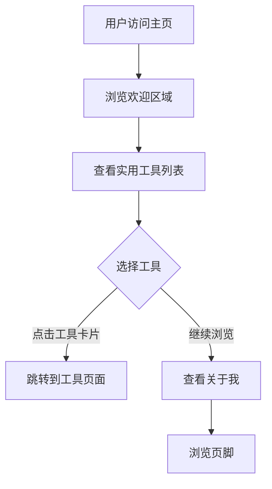

# 产品需求文档 (PRD) - 个人博客主页

## 1. 产品概述

一个简洁优雅的**个人博客主页**，作为个人技术展示和工具分享的入口。提供实用工具导航、个人介绍等功能，帮助访客快速了解博主并使用其开发的工具。

**核心价值**：打造个人品牌形象，展示技术能力，提供实用工具入口。

## 2. 核心功能

### 2.1 功能模块

1. **导航模块**
   - 顶部固定导航栏
   - 页面内锚点导航（实用工具、关于我）
   - 响应式设计适配移动端

2. **欢迎区域模块**
   - 博主头像/Logo展示
   - 博客名称和副标题
   - 欢迎语展示

3. **实用工具展示模块**
   - 工具卡片列表展示
   - 工具名称、描述、图标
   - 一键跳转工具页面
   - 悬停交互效果

4. **关于我模块**
   - 个人介绍
   - 技术背景描述
   - 联系方式（可选）

5. **页脚模块**
   - 版权信息
   - 快速链接

### 2.2 页面详情

| 页面模块 | 功能描述 |
| ---- | --------------------------- |
| 导航栏 | 固定顶部、Logo、导航链接 |
| 欢迎区 | 头像、标题、欢迎语 |
| 工具列表 | 卡片式布局展示实用工具 |
| 关于我 | 个人介绍、技术背景 |
| 页脚 | 版权信息、快速链接 |

## 3. 核心流程

### 3.1 用户访问流程



## 4. 用户界面设计

### 4.1 设计风格

* **设计理念**：简洁清爽、专业大气，突出内容
* **色彩方案**：
  * 主色：#667eea（紫色，代表创意与科技）
  * 强调色：#764ba2（深紫，用于按钮和交互元素）
  * 背景色：#F8FAFC（浅灰白）
  * 卡片背景：#FFFFFF
* **字体**：
  * 标题：Noto Sans SC (Bold)
  * 正文：Noto Sans SC
* **圆角**：12px-16px
* **阴影**：柔和阴影 `0 4px 20px rgba(0, 0, 0, 0.06)`

### 4.2 页面布局

```
┌─────────────────────────────────────────────┐
│  🌟 我的个人博客          实用工具 | 关于我   │
├─────────────────────────────────────────────┤
│                                             │
│           🚀                                │
│        欢迎来到我的技术小站                    │
│     这里汇聚了我开发的实用工具...              │
│                                             │
├─────────────────────────────────────────────┤
│  🛠️ 实用工具                                │
│                                             │
│  ┌─────────────────┐  ┌─────────────────┐   │
│  │ 🔐 密码生成器    │  │ 📅 工作日计算器 │   │
│  │ 生成高强度密码...│  │ 精确计算日期... │   │
│  │ [立即使用 →]     │  │ [立即使用 →]   │   │
│  └─────────────────┘  └─────────────────┘   │
│                                             │
├─────────────────────────────────────────────┤
│  👤 关于我                                  │
│                                             │
│  ┌─────────────────────────────────────┐    │
│  │ 🧩 一个爱折腾的普通人                │    │
│  │ 热衷于尝试各种新鲜事物...            │    │
│  └─────────────────────────────────────┘    │
│                                             │
├─────────────────────────────────────────────┤
│  © 2024 我的个人博客 | 持续更新中            │
└─────────────────────────────────────────────┘
```

### 4.3 响应式设计

* 桌面端：居中显示，最大宽度1000px
* 平板端：自适应布局，工具卡片单列显示
* 移动端：全宽显示，垂直堆叠布局

## 5. 数据存储

| 数据项 | 存储方式 | 说明 |
| ------ | ------------ | -------------------------------------------- |
| 页面内容 | 静态HTML | 页面结构和内容直接写在HTML文件中 |
| 工具链接 | 静态链接 | 硬编码的工具页面URL |

## 6. 边界情况处理

1. **工具页面不存在**：使用相对路径确保链接正确性
2. **图片加载失败**：使用emoji图标替代，无需图片资源
3. **浏览器兼容性**：使用Tailwind CSS确保跨浏览器兼容性
4. **移动端适配**：响应式布局适配各种屏幕尺寸