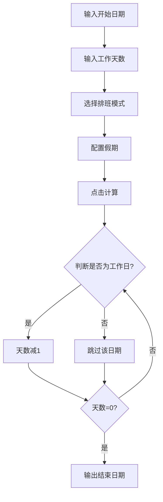

# 产品需求文档 (PRD) - 工作日期计算器

## 1. 产品概述

一款专业的**工作日期计算工具**，帮助用户精确计算项目交付日期、项目周期和工作进度。支持多种排班模式（大小周、单休、双休）和灵活的假期配置（国家法定假期、事假勾选），确保日期计算的准确性。

**核心价值**：解决"加了N天班到底哪天能交付"这个职场常见痛点。

## 2. 核心功能

### 2.1 功能模块

1. **日期计算核心模块**

   * 输入开始日期

   * 输入工作天数

   * 一键计算结束日期

   * 显示计算详情（包含每一天的标记）

2. **排班模式配置模块**

   * 双休模式（标准工时，周六周日休息）

   * 单休模式（每周休息1天）

   * 大小周模式（单周休息1天，双周休息2天，循环）

   * 自定义模式（可指定每周具体哪天休息）

3. **假期管理模块**

   * 国家法定假期预设（元旦、春节、清明、劳动节、端午、中秋、国庆）

   * 手动添加事假/调休日期

   * 假期列表展示与删除

4. **配置面板模块**

   * 当前排班模式选择

   * 假期管理（增删改查）

   * 配置本地存储（LocalStorage持久化）

### 2.2 页面详情

| 页面模块 | 功能描述                        |
| ---- | --------------------------- |
| 计算区域 | 日期选择器 + 天数输入框 + 计算按钮 + 结果展示 |
| 排班配置 | 单选按钮组选择排班模式 + 大小周起始周设置      |
| 假期管理 | 法定假期开关 + 事假日期选择器 + 已添加假期列表  |
| 日历预览 | 可视化展示计算结果中每一天的工作日/休息日标记     |

## 3. 核心流程

### 3.1 日期计算主流程



### 3.2 日期判断逻辑

```
工作日定义 = 普通工作日 且 非休息日 且 非法定假期 且 非事假
```

## 4. 用户界面设计

### 4.1 设计风格

* **设计理念**：工具类应用，强调效率与清晰度，采用卡片式布局

* **色彩方案**：

  * 主色：#3B82F6（蓝色，代表专业可靠）

  * 强调色：#10B981（绿色，用于工作日标记）

  * 警示色：#EF4444（红色，用于休息日/假期标记）

  * 背景色：#F8FAFC（浅灰白）

  * 卡片背景：#FFFFFF

* **字体**：

  * 标题：思源黑体 / Noto Sans SC (Bold)

  * 正文：Inter / 思源黑体

* **圆角**：8px-12px

* **阴影**：柔和阴影 `0 4px 6px -1px rgba(0, 0, 0, 0.1)`

### 4.2 页面布局

```
┌─────────────────────────────────────────────┐
│              工作日期计算器                    │
├─────────────────────────────────────────────┤
│ ┌─────────────────────────────────────────┐ │
│ │         📅 日期计算区域                   │ │
│ │  开始日期: [____]  天数: [____]         │ │
│ │           [开始计算]                     │ │
│ │  结果: 2026年5月25日 (周一)              │ │
│ └─────────────────────────────────────────┘ │
│                                             │
│ ┌─────────────────────────────────────────┐ │
│ │         ⚙️ 排班模式配置                   │ │
│ │  ○ 双休  ○ 单休  ○ 大小周  ○ 自定义      │ │
│ │  [大小周起始周: 第1周]                   │ │
│ └─────────────────────────────────────────┘ │
│                                             │
│ ┌─────────────────────────────────────────┐ │
│ │         🎯 假期管理                       │ │
│ │  ☑️ 使用法定假期                          │ │
│ │  事假日期: [____] [+添加]                │ │
│ │  已添加事假: [5/20][5/21][删除]          │ │
│ └─────────────────────────────────────────┘ │
│                                             │
│ ┌─────────────────────────────────────────┐ │
│ │         📆 日历预览                       │ │
│ │  日历网格 + 颜色标记工作日/休息日          │ │
│ └─────────────────────────────────────────┘ │
└─────────────────────────────────────────────┘
```

### 4.3 响应式设计

* 桌面端：居中显示，最大宽度800px

* 移动端：全宽显示，垂直堆叠布局

* 触摸友好：按钮高度 ≥ 44px

## 5. 数据存储

| 数据项    | 存储方式         | 说明                                           |
| ------ | ------------ | -------------------------------------------- |
| 排班模式   | LocalStorage | 字符串：'double'/'single'/'alternating'/'custom' |
| 大小周起始周 | LocalStorage | 数字：1或2                                       |
| 自定义休息日 | LocalStorage | 数组：\[0,6]表示周日周六休息                            |
| 法定假期开关 | LocalStorage | 布尔值                                          |
| 事假日期列表 | LocalStorage | 数组：\['2026-05-20','2026-05-21']              |

## 6. 边界情况处理

1. **开始日期为休息日**：自动跳过，从下一个工作日开始计算
2. **法定假期跨越周末**：周末已标记为休息，不再重复标记
3. **大小周配置**：循环计算，以起始周为基础每2周切换
4. **天数输入**：仅支持正整数，最小为1
5. **日期范围**：支持跨年计算，自动处理闰年

