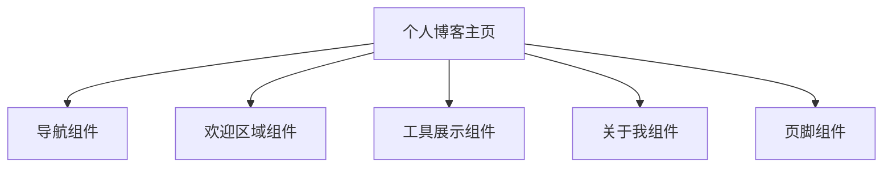

# 技术方案文档 (TECH) - 个人博客主页

## 1. 架构设计



## 2. 技术描述

- 前端：纯HTML5 + JavaScript
- 样式：Tailwind CSS 3（CDN引入）
- 字体：Noto Sans SC（Google Fonts）
- 图标：Emoji图标
- 构建工具：无需构建，直接静态部署

## 3. 目录结构

```
MyAiProj/
├── index.html                    # 个人博客主页
├── HTML_密码生成器/
│   └── HTML_密码生成器.html      # 密码生成器工具
├── HTML_工作日计算器/
│   └── HTML_工作日计算器.html    # 工作日计算器工具
└── .trae/
    └── documents/
        ├── PRD-个人博客主页.md
        └── TECH-个人博客主页.md
```

## 4. 核心组件

| 组件 | 功能 | 实现方式 |
|------|------|----------|
| Header | 固定导航栏，包含Logo和导航链接 | HTML + Tailwind CSS |
| Hero | 欢迎区域，包含头像和欢迎语 | HTML + Tailwind CSS |
| Tools | 工具卡片列表，展示实用工具 | HTML + Tailwind CSS + CSS动画 |
| About | 关于我介绍区域 | HTML + Tailwind CSS |
| Footer | 页脚，包含版权信息 | HTML + Tailwind CSS |

## 5. 关键代码

### 5.1 工具卡片组件结构

```html
<article class="bg-white rounded-xl shadow-sm border border-gray-100 p-6 card-hover">
    <div class="flex items-start gap-4">
        <div class="w-12 h-12 bg-gradient-to-br from-purple-100 to-purple-200 rounded-xl flex items-center justify-center flex-shrink-0">
            <span class="text-2xl">🔐</span>
        </div>
        <div class="flex-1">
            <h3 class="text-lg font-semibold text-gray-800 mb-2">工具名称</h3>
            <p class="text-gray-500 text-sm mb-4">工具描述...</p>
            <button class="gradient-btn text-white px-4 py-2 rounded-lg">立即使用</button>
        </div>
    </div>
</article>
```

### 5.2 自定义CSS样式

```css
.card-hover {
    transition: all 0.3s ease;
}
.card-hover:hover {
    transform: translateY(-2px);
    box-shadow: 0 10px 30px rgba(0, 0, 0, 0.08);
}
.gradient-btn {
    background: linear-gradient(135deg, #667eea 0%, #764ba2 100%);
    border: none;
    transition: all 0.3s ease;
}
.gradient-btn:hover {
    transform: translateY(-2px);
    box-shadow: 0 6px 20px rgba(102, 126, 234, 0.4);
}
```

## 6. 样式变量

| 变量名 | 值 | 用途 |
|--------|-----|------|
| 主色调 | #667eea | 按钮、链接、强调元素 |
| 深紫色 | #764ba2 | 渐变结束色 |
| 背景色 | #F8FAFC | 页面背景 |
| 卡片背景 | #FFFFFF | 组件卡片 |
| 圆角 | 12px-16px | 卡片、按钮圆角 |

## 7. 性能优化

1. **CSS优化**：使用Tailwind CSS CDN，减少本地样式文件体积
2. **图标优化**：使用emoji图标，无需额外图片资源请求
3. **响应式设计**：使用Tailwind响应式类，适配各种设备
4. **减少HTTP请求**：合并CSS和JavaScript资源

## 8. 部署说明

- **部署方式**：静态文件部署
- **服务器要求**：支持静态HTML文件的Web服务器（如Nginx、Apache）
- **路径配置**：确保工具页面相对路径正确
- **CDN依赖**：依赖Tailwind CSS和Google Fonts CDN