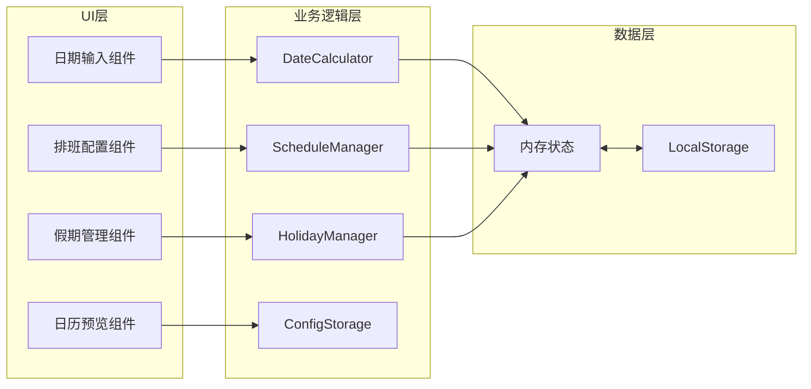

# 技术架构文档 - 工作日期计算器

## 1. 技术选型

| 技术项 | 选择 | 说明 |
|--------|------|------|
| 前端框架 | 原生 HTML5 + CSS3 + JavaScript | 轻量级单文件应用，无需构建 |
| 样式方案 | Tailwind CSS (CDN) | 快速构建响应式UI |
| 图表库 | 原生日历组件 | 无需额外依赖 |
| 日期处理 | 原生 Date 对象 | 满足所有日期计算需求 |
| 数据存储 | LocalStorage API | 浏览器本地持久化配置 |
| 图标 | Heroicons (CDN) | SVG图标库 |

## 2. 系统架构



## 3. 核心模块设计

### 3.1 DateCalculator（日期计算器）

**职责**：核心计算逻辑，计算工作日天数

```javascript
class DateCalculator {
    // 主计算方法
    calculateEndDate(startDate, workDays, scheduleConfig, holidays) {
        // 1. 判断开始日期是否为工作日
        // 2. 循环遍历日期，直到工作日天数达到要求
        // 3. 返回结束日期
    }
    
    // 判断某天是否为工作日
    isWorkDay(date, scheduleConfig, holidays) {
        // 1. 检查是否为事假（优先级最高）
        // 2. 检查是否为法定假期
        // 3. 检查是否为调休补班
        // 4. 检查排班规则
        // 5. 返回布尔值
    }
}
```

### 3.2 ScheduleManager（排班管理器）

**职责**：管理各种排班模式的休息日计算

```javascript
class ScheduleManager {
    // 双休：周六、周日休息
    getDoubleRestDays(date) { return [0, 6]; }
    
    // 单休：周日休息
    getSingleRestDays(date) { return [0]; }
    
    // 大小周：单周休1天，双周休2天
    getAlternatingRestDays(date, startWeek) { /* 计算逻辑 */ }
    
    // 自定义休息日
    getCustomRestDays(config) { return config.customDays; }
}
```

### 3.3 HolidayManager（假期管理器）

**职责**：管理法定假期和事假

```javascript
class HolidayManager {
    // API获取假期数据
    async loadHolidaysFromAPI(year) { /* 调用timor.tech API */ }
    
    // 检查是否为法定假期
    isLegalHoliday(date) { /* 逻辑 */ }
    
    // 添加/删除事假
    addLeaveDay(date) { /* 逻辑 */ }
    removeLeaveDay(date) { /* 逻辑 */ }
}
```

### 3.4 ConfigStorage（配置存储）

**职责**：持久化用户配置

```javascript
class ConfigStorage {
    static STORAGE_KEY = 'date_calculator_config';
    
    // 保存配置到LocalStorage
    save(config) { /* 逻辑 */ }
    
    // 从LocalStorage加载配置
    load(config) { /* 逻辑 */ }
    
    // 重置为默认配置
    reset() { /* 逻辑 */ }
}
```

## 4. 假期数据API设计

### 4.1 API接口

**API地址**：`https://timor.tech/api/holiday/year/{year}`

**响应格式**：
```json
{
    "code": 0,
    "holiday": {
        "01-01": {
            "holiday": true,
            "name": "元旦",
            "date": "2024-01-01",
            "wage": 3,
            "rest": 1
        }
    },
    "workday": []
}
```

### 4.2 数据处理方案

#### 问题分析
- API的 `holiday` 字段包含假期数据（`holiday: true`）
- API的 `workday` 字段**可能为空**，不包含调休数据
- 需要额外的调休数据处理

#### 解决方案

**方案1：API数据解析**
- 优先使用 `item.holiday` 字段判断：
  - `holiday: true` → 法定假期（type=1，休息）
  - `holiday: false` → 调休补班（type=3，工作）
- 优先使用 `item.date` 字段获取完整日期

**方案2：默认调休数据**
```javascript
const DEFAULT_WORKDAYS = {
    '2024-02-04': '春节前补班',
    '2024-02-18': '春节后补班',
    '2024-04-28': '五一前补班',
    '2024-10-07': '国庆后补班',
    '2025-01-26': '春节前补班',
    '2025-02-08': '春节后补班',
    '2025-04-26': '五一前补班',
    '2025-05-09': '五一后补班',
    '2025-09-28': '国庆前补班',
    '2025-10-11': '国庆后补班'
};
```

**方案3：数据加载流程**
1. 用户输入开始日期
2. 解析出年份 `year` 和 `year+1`
3. 调用API获取两年的假期数据
4. 补充默认调休数据（如果API没有返回）
5. 开始日期计算

### 4.3 工作日判断优先级

```
事假 > 法定假期 > 调休 > 排班规则
```

判断逻辑：
```javascript
function isWorkDay(date) {
    // 1. 事假 → 休息
    if (isLeaveDay(date)) return false;
    
    // 2. 法定假期(type=1) → 休息
    const info = HOLIDAY_INFO[dateStr];
    if (info && info.type === 1) return false;
    
    // 3. 调休上班(type=3) → 工作
    if (info && info.type === 3) return true;
    
    // 4. 排班规则
    return !isRestDayBySchedule(date);
}
```

## 5. 数据模型

### 5.1 配置数据结构

```typescript
interface CalculatorConfig {
    scheduleMode: 'double' | 'single' | 'alternating' | 'custom';
    alternatingStartWeek: 1 | 2;
    customRestDays: number[]; // 0=周日, 1=周一, ..., 6=周六
    useLegalHolidays: boolean;
    leaveDays: string[]; // ['2026-05-20', '2026-05-21']
}
```

### 5.2 LocalStorage 数据格式

```json
{
    "scheduleMode": "alternating",
    "alternatingStartWeek": 1,
    "customRestDays": [],
    "useLegalHolidays": true,
    "leaveDays": ["2026-05-20", "2026-05-21"]
}
```

## 6. API 接口设计

本项目为纯前端单文件应用，无后端API。所有功能通过JavaScript类方法调用实现。

## 7. 文件结构

```
MyBlog/
└── date-calculator.html     # 单文件应用，包含HTML/CSS/JS全部代码
```

## 8. 依赖资源

| 资源 | CDN地址 | 用途 |
|------|---------|------|
| Tailwind CSS | https://cdn.tailwindcss.com | 样式框架 |
| Heroicons | inline SVG | 图标资源 |
| Google Fonts | https://fonts.googleapis.com | 字体（可选） |

## 9. 浏览器兼容性

- Chrome 80+
- Firefox 75+
- Safari 13+
- Edge 80+
- 不支持 IE 11

## 10. 性能要求

- 首屏加载：< 1秒（单文件，无外部JS）
- 计算响应：< 100ms（最多计算365天）
- 内存占用：< 50MB

## 11. 已知问题与解决方案

### 问题1：调休数据缺失

**问题**：API的 `workday` 字段可能为空，导致调休补班日期无法识别

**解决方案**：
1. 内置 `DEFAULT_WORKDAYS` 常量，包含2024-2025年的常见调休日期
2. API加载完成后，自动补充默认调休数据
3. 用户可通过事假功能手动添加其他调休日期

### 问题2：跨年假期数据加载

**问题**：计算跨年日期时，需要两年的假期数据

**解决方案**：
1. 根据开始日期自动加载 `year` 和 `year+1` 两年数据
2. 使用 `LOADED_YEARS` 数组记录已加载年份，避免重复请求
3. 合并两年数据到同一个假期对象中

### 问题3：调休补班日显示

**问题**：调休补班日（周末但需要上班）与普通工作日显示相同，无法区分

**解决方案**：
1. 在 `getDayType` 函数中优先检查调休补班（`type === 3`）
2. 为调休补班日添加特殊颜色标记（橙色）
3. 支持点击调休日期显示提示信息

## 12. 日历预览优化

### 12.1 日期类型颜色方案

| 日期类型 | 颜色 | 说明 |
|----------|------|------|
| 工作日 | 绿色 | 正常工作日 |
| 休息日 | 红色 | 周六、周日 |
| 法定假期 | 紫色 | 元旦、春节、国庆等 |
| 调休补班 | 橙色 | 周末但需要上班 |
| 事假 | 黄色 | 用户添加的事假 |
| 覆盖范围内 | 深绿色 | 计算范围内的工作日 |

### 12.2 日期点击提示

点击日历中的日期时显示提示框：
- 法定假期：显示假期名称
- 调休补班：显示补班原因
- 普通日期：显示日期和星期

### 12.3 双列日历布局

使用两列网格布局显示日历：
- 并排显示两个月
- 自动向下排列更多月份
- 响应式设计，支持移动端
