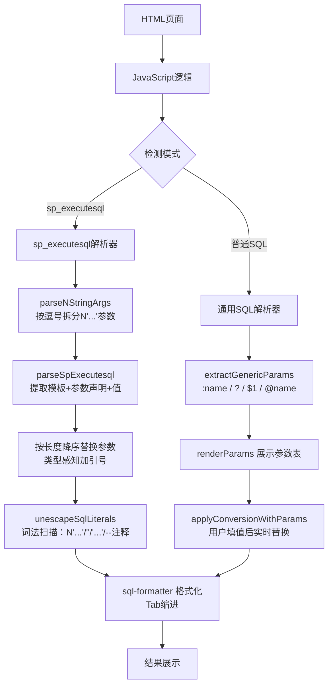

## 1. Architecture Design

纯前端单页应用，无后端依赖，所有处理在浏览器端完成。



### 核心函数模块

| 函数 | 职责 |
|------|------|
| `convertSql()` | 入口，检测模式分发 |
| `splitByGo(text)` | 按 `go` 分割多条语句 |
| `convertSpExecutesql()` | 批量处理 sp_executesql 语句 |
| `parseSpExecutesql()` | 单条 sp_executesql 解析：提取模板 → 类型推断 → 参数替换 → smart unescape |
| `parseNStringArgs(text)` | 按逗号拆分外层参数列表（跳过`N'...'`和`'...'`内的逗号） |
| `parseValueToken(text, start)` | 逐个解析参数值（含 `@param=` 命名参数识别） |
| `parseNOrPlainString(text, start)` | 解析 `N'...'` 或 `'...'` 字符串 |
| `parseQuotedString(text, start, quote)` | 通用引号字符串解析，正确处理 `''` 转义 |
| `unescapeSqlLiterals(sql)` | 词法扫描：仅在 `N'...'`/`'...'`/`--` 块外部将 `''` → `'` |
| `escapeSingleQuote(str)` | `'` → `''`（用于新插入参数值的转义） |
| `formatSql(sql, dbType)` | 调用 sql-formatter 格式化，失败返回原始 SQL |

## 2. Technology Description
- Frontend: 纯HTML5 + CSS3 + JavaScript (ES6+)，无构建工具，无需框架
- SQL格式化: sql-formatter@15.3.1 (CDN引入)
- 无后端，无数据库依赖
- 缩进：Tab（`\t`）

## 3. 加工链路

```
外层 N'...' 模板
  ↓ parseQuotedString: '' → ' （外层转义解除）
模板值（引号已正确）
  ↓ 参数替换（@P0 → 值，按长度降序，类型感知加引号）
静态SQL（部分 '' 未解）
  ↓ unescapeSqlLiterals: 词法扫描 — N'...' / '' → ' / '...' / --注释
静态SQL（引号全部正确）
  ↓ sql-formatter 格式化
最终输出
```

## 4. 关键设计决策

| 决策 | 原因 |
|------|------|
| 参数按长度降序替换 | 防止 `@P1` 的正则先于 `@P10` 匹配，导致 `@P10` 被污染为 `xxx0` |
| 仅 NULL 不加引号，其余全加 | 避免 `7954713c-1` 被 `/^\d/` 误判为数字 |
| 在 `N'...'` 内部不触发 `''`→`'` | 保护 `@FilterSql = N'...!= ''' + ...` 中的 `'''` 不被破坏 |
| 每条 go 语句独立 try-catch | 一条失败不阻塞其他条 |
| `@param=` 前缀剥离后递归解析 | 支持 `@P0='value'` 命名参数格式 |

## 5. Route Definitions
无需路由，单页应用

## 6. API Definitions
无需API

## 7. Data Model
无需数据模型
