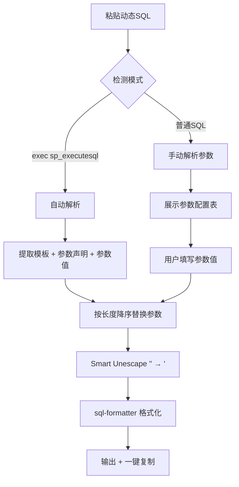

## 1. Product Overview
- 动态SQL转静态SQL工具，帮助开发者快速将包含参数绑定的动态SQL转换为可直接执行的静态SQL，并提供自动格式化功能
- 核心场景：将 SQL Server 的 `sp_executesql`、MySQL/PostgreSQL 的 `?` `:name` 等参数化 SQL 转换为纯静态可执行 SQL
- 支持MySQL、PostgreSQL、Oracle、SQL Server多种数据库语法

## 2. Core Features

### 2.1 双模式引擎
| 模式 | 检测条件 | 工作方式 |
|------|---------|---------|
| 自动模式 (SQL Server) | 输入以 `exec sp_executesql` 开头 | 自动解析所有 N'...' 参数，提取 SQL 模板、参数声明、参数值，一键转换 |
| 手动模式 (通用SQL) | 其他所有情况 | 解析占位符（`:name` / `?` / `$1` / `@name`），显示参数配置表，手动填值 |

### 2.2 sp_executesql 解析能力
- 解析 N'...' 外层引号字符串，正确处理 `''` 转义
- 解析参数声明部分（`@P0 int, @P1 nvarchar(4000), ...`）
- 支持两种参数值格式：
  - 位置参数：`N'admin', N'2652052112', N'12'`
  - 命名参数：`@P0='A1B2C3D4-...', @P2=1001`
- 支持 NULL 裸值和普通值（`N'...'`, `'...'`）
- 多条语句 `go` 分隔支持
- 每条语句独立错误处理，一条失败不影响其他

### 2.3 参数替换规则
- 参数类型感知：INT/BIGINT/SMALLINT/TINYINT/BIT/FLOAT 等数值类型不加引号
- 字符串/日期/UNIQUEIDENTIFIER 等类型加单引号，内部 `'` 转义为 `''`
- 按参数名长度降序替换，防止 `@P1` 污染 `@P10`

### 2.4 Smart Unescape
- 参数替换后，对模板中的字符串字面量做词法扫描
- 仅在 `N'...'` 和 `'...'` 定界字符串**外部**将 `''` → `'`
- 保护 `N'...'` 和 `'...'` 内部内容原样不变
- 保护 `--` 注释行原样保留

### 2.5 格式化输出
- 使用 sql-formatter 库自动格式化
- Tab 缩进
- 数据库方言适配（MySQL / PostgreSQL / sql / TSQL）
- 格式化失败时返回原始 SQL 不中断

### 2.6 一键复制与清空

## 3. Core Process

## 4. User Interface Design

### 4.1 Design Style
- 主色调：蓝色系(#3b82f6)，辅助色：深灰色(#1f2937)
- 按钮样式：圆角矩形，有悬停效果
- 字体：系统默认无衬线字体
- 布局风格：上下分栏，上半部分输入区，下半部分输出区
- SQL 输入/输出区：深色代码编辑器风格

### 4.2 Page Design Overview
| Page Name | Module Name | UI Elements |
|-----------|-------------|-------------|
| 主页面 | 模式指示器 | 自动检测后显示"自动模式"或"手动模式"徽章 |
| 主页面 | 数据库选择 | 下拉选择框（MySQL/PostgreSQL/Oracle/SQL Server） |
| 主页面 | SQL输入区 | 暗色主题的代码编辑器样式 textarea |
| 主页面 | 操作按钮区 | 转换并格式化、清空 |
| 主页面 | 参数配置区 | 仅在手动模式下显示，表格形式 |
| 主页面 | 输出区 | 暗色主题只读显示，带复制按钮 |

### 4.3 Responsiveness
桌面优先，响应式适配平板和移动端，在小屏幕上改为垂直排列

### 4.4 3D Scene Guidance (if applicable)
不涉及3D场景
